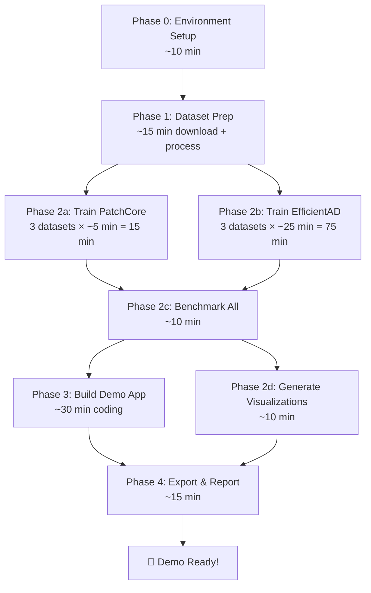

# Airbag Defect Detection — Demo Implementation Plan

Build a working anomaly detection demo on proxy textile datasets to prove execution capability to stakeholders.

---

## User Review Required

> [!CAUTION]
> **Python 3.14.5 Compatibility Risk**: Your system has Python 3.14.5 installed, which is extremely new. PyTorch and Anomalib very likely **do not support Python 3.14 yet**. We will need to either:
> - **(A) Install Python 3.11 or 3.12** alongside your current Python (recommended — safest)
> - **(B) Try Python 3.14 and fall back if packages fail to install**
>
> I strongly recommend option **(A)** — install Python 3.12.x from [python.org](https://www.python.org/downloads/) before we begin.

> [!IMPORTANT]
> **Demo App Technology**: I plan to build the interactive demo using **Gradio** (a Python library that creates a web UI in ~50 lines of code). This gives us:
> - Drag-and-drop image upload
> - Side-by-side original vs. heatmap comparison
> - Real-time anomaly scoring
> - Runs in the browser — stakeholders can try it themselves
>
> Alternative: Streamlit. Let me know if you have a preference.

---

## Open Questions

1. **Python version**: Do you want me to guide you through installing Python 3.12, or would you prefer to try with 3.14 first?
2. **MVTec AD dataset**: It requires registration at mvtec.com for download. Anomalib can auto-download it, but if that fails, are you okay manually downloading it from their site or Kaggle?
3. **Demo scope**: Should the demo focus on just **MVTec AD** (carpet + grid) for simplicity, or do you want **AITEX** included too? (AITEX needs extra preprocessing work since images are 4096×256 and need patching.)
4. **Languages**: Should the demo UI be in **English** (for the technical stakeholders) or **Arabic**?

---

## Proposed Changes

### Phase 0: Environment Setup

Set up a clean, isolated Python environment with all dependencies.

#### [NEW] [requirements.txt](file:///d:/Programming/Antigravity-Projects/AirBags-CV/requirements.txt)
Core dependencies:
```
anomalib[full]       # Anomalib with all backends
torch                # PyTorch (auto-resolved by anomalib)
torchvision          # Vision utilities
gradio               # Demo web UI
matplotlib           # Plotting & visualization
seaborn              # Statistical plots
pandas               # Results tables
opencv-python        # Image processing
Pillow               # Image I/O
scikit-learn         # Metrics (confusion matrix, etc.)
```

**Steps:**
1. Create virtual environment: `python -m venv .venv`
2. Activate: `.venv\Scripts\activate`
3. Install PyTorch with CUDA: `pip install torch torchvision --index-url https://download.pytorch.org/whl/cu126`
4. Install Anomalib: `pip install "anomalib[full]"`
5. Install demo dependencies: `pip install gradio matplotlib seaborn pandas`

---

### Phase 1: Dataset Acquisition & Preparation

#### MVTec AD (auto-download via Anomalib)
- Categories: **carpet**, **grid**, **leather**
- Anomalib's `MVTecAD` datamodule handles download + structure automatically
- No manual preprocessing needed
- Expected disk usage: ~1.5GB per category

#### AITEX (manual download + preprocessing)
- Source: [Kaggle](https://www.kaggle.com/datasets/rmshashi/fabric-defect-dataset) or [AITEX AFID](https://www.aitex.es/afid/)
- **Preprocessing needed**: Images are 4096×256 pixels — must be sliced into 256×256 patches
- Restructure into Anomalib `Folder` format:
  ```
  datasets/aitex/
  ├── train/
  │   └── good/           # Defect-free patches
  └── test/
      ├── good/           # Defect-free test patches
      └── anomaly/        # Defective patches (with masks)
  ```

#### [NEW] [scripts/prepare_aitex.py](file:///d:/Programming/Antigravity-Projects/AirBags-CV/scripts/prepare_aitex.py)
Python script to:
1. Download AITEX dataset (or load from local path)
2. Slice 4096×256 images into 256×256 patches
3. Split defect-free images into train/test (80/20)
4. Map defective images + masks to test/anomaly
5. Output in Anomalib `Folder` format

---

### Phase 2: Model Training & Benchmarking

Train **2 algorithms × 3 datasets = 6 models**, then benchmark all.

#### [NEW] [scripts/train_models.py](file:///d:/Programming/Antigravity-Projects/AirBags-CV/scripts/train_models.py)

| Model | Dataset | Key Config | Expected Training Time (RTX 4060) |
|-------|---------|-----------|-----------------------------------|
| PatchCore | MVTec Carpet | backbone=wide_resnet50_2, coreset_ratio=0.1, 1 epoch | ~2-5 minutes |
| PatchCore | MVTec Grid | Same config | ~2-5 minutes |
| PatchCore | AITEX Fabric | Same config | ~2-5 minutes |
| EfficientAD | MVTec Carpet | model_size="s", 70 epochs | ~15-30 minutes |
| EfficientAD | MVTec Grid | Same config | ~15-30 minutes |
| EfficientAD | AITEX Fabric | Same config | ~15-30 minutes |

**PatchCore config:**
```python
model = Patchcore(
    backbone="wide_resnet50_2",
    layers=["layer2", "layer3"],
    coreset_sampling_ratio=0.1,
    num_neighbors=9,
    pre_trained=True,
)
engine = Engine(max_epochs=1, accelerator="auto")
```

**EfficientAD config:**
```python
model = EfficientAd(
    model_size="s",
    lr=0.0001,
    weight_decay=0.00001,
)
engine = Engine(max_epochs=70, accelerator="auto")
```

#### [NEW] [scripts/benchmark.py](file:///d:/Programming/Antigravity-Projects/AirBags-CV/scripts/benchmark.py)

After training, collect and save:
- **Image-level AUROC** (primary metric — "can it tell good from bad?")
- **Pixel-level AUROC** (segmentation metric — "can it locate the defect?")
- **F1 Score** at optimal threshold
- **Inference latency** (ms/image on GPU and CPU)
- **Confusion matrix** per model
- **Per-defect-type breakdown** (e.g., carpet → hole vs thread vs color)
- Save all results to `results/benchmark_results.csv` and generate plots

#### [NEW] [scripts/generate_visualizations.py](file:///d:/Programming/Antigravity-Projects/AirBags-CV/scripts/generate_visualizations.py)

Generate stakeholder-ready visual outputs:
- Heatmap overlay grids (original | heatmap | predicted mask | ground truth)
- Best/worst prediction examples per category
- Bar charts comparing models across datasets
- Save all to `results/visualizations/`

---

### Phase 3: Interactive Demo Application (Gradio)

#### [NEW] [demo/app.py](file:///d:/Programming/Antigravity-Projects/AirBags-CV/demo/app.py)

A Gradio web app with **3 tabs**:

**Tab 1 — Live Inspection:**
- Drag-and-drop or browse to upload an image
- Select model (PatchCore / EfficientAD) and dataset (Carpet / Grid / AITEX)
- Display side-by-side: Original → Anomaly Heatmap → Predicted Defect Mask
- Show anomaly score with PASS/FAIL verdict and confidence bar
- Include example images for quick testing

**Tab 2 — Benchmark Results:**
- AUROC comparison table (all models × all datasets)
- Interactive bar charts
- Inference speed comparison
- Sample detection gallery

**Tab 3 — How It Works:**
- Brief visual explanation of unsupervised anomaly detection
- "Why this works for airbags" — the cold-start argument
- Continual learning diagram
- Hardware requirements overview (from Research 3)

#### [NEW] [demo/inference.py](file:///d:/Programming/Antigravity-Projects/AirBags-CV/demo/inference.py)
Inference wrapper that:
- Loads trained model checkpoints
- Runs prediction on uploaded image
- Returns heatmap, score, label, and mask
- Handles image resizing/normalization

---

### Phase 4: Model Export & Deliverables

#### [NEW] [scripts/export_models.py](file:///d:/Programming/Antigravity-Projects/AirBags-CV/scripts/export_models.py)
- Export best model to **OpenVINO IR format** (for edge deployment story)
- Export to **ONNX** (for cross-platform compatibility)
- Measure inference speed of exported models vs PyTorch

#### [NEW] [results/demo_report.md](file:///d:/Programming/Antigravity-Projects/AirBags-CV/results/demo_report.md)
Auto-generated markdown report containing:
- All benchmark numbers in tables
- Embedded heatmap visualizations
- Model comparison analysis
- "Next steps with real airbag data" section

---

## Final Project Structure

```
AirBags-CV/
├── First-deepresesarch.md              # Existing research
├── Airbag Defect Detection PoC...txt   # Existing research
├── Airbag Fabric Inspection...txt      # Existing research
├── requirements.txt                    # Python dependencies
├── .venv/                              # Virtual environment
│
├── scripts/
│   ├── prepare_aitex.py                # AITEX data preprocessing
│   ├── train_models.py                 # Train all models
│   ├── benchmark.py                    # Collect metrics
│   ├── generate_visualizations.py      # Create stakeholder visuals
│   └── export_models.py               # Export to OpenVINO/ONNX
│
├── demo/
│   ├── app.py                          # Gradio demo application
│   └── inference.py                    # Inference wrapper
│
├── datasets/                           # Auto-created by Anomalib
│   ├── MVTec/
│   │   ├── carpet/
│   │   ├── grid/
│   │   └── leather/
│   └── aitex/
│       ├── train/good/
│       └── test/{good,anomaly}/
│
├── weights/                            # Trained model checkpoints
│   ├── patchcore_carpet/
│   ├── patchcore_grid/
│   ├── efficientad_carpet/
│   └── ...
│
├── results/
│   ├── benchmark_results.csv           # Raw metrics
│   ├── demo_report.md                  # Stakeholder report
│   └── visualizations/                 # Charts, heatmaps, grids
│       ├── comparison_charts/
│       ├── heatmap_samples/
│       └── confusion_matrices/
│
└── exports/                            # Exported models
    ├── openvino/
    └── onnx/
```

---

## Execution Order



**Total estimated time: ~3-4 hours** (mostly model training wait time)

---

## Verification Plan

### Automated Tests
1. **Model training verification**: Each model must achieve >90% image-level AUROC on MVTec carpet/grid (published baselines are 98-99%)
2. **Inference test**: Run prediction on 10 test images, verify heatmaps are generated and scores are in [0, 1]
3. **Export verification**: Load OpenVINO model, run inference, verify results match PyTorch predictions within tolerance
4. **Demo app test**: Launch Gradio app, upload test image, verify UI renders correctly with heatmap overlay

### Manual Verification
1. **Visual inspection**: Review heatmap outputs — do they highlight actual defect regions?
2. **Demo walkthrough**: Run the full demo flow as if presenting to stakeholders
3. **Speed check**: Verify inference latency is <100ms on GPU for real-time claim
4. **Record demo video**: 2-minute screen recording of the demo in action

### Success Criteria
| Metric | Target |
|--------|--------|
| Image AUROC (MVTec Carpet) | ≥ 95% |
| Image AUROC (MVTec Grid) | ≥ 95% |
| Pixel AUROC (MVTec Carpet) | ≥ 90% |
| GPU Inference Latency | < 100ms |
| Demo App | Functional with all 3 tabs |
| Heatmap Quality | Visually highlights defect regions |
